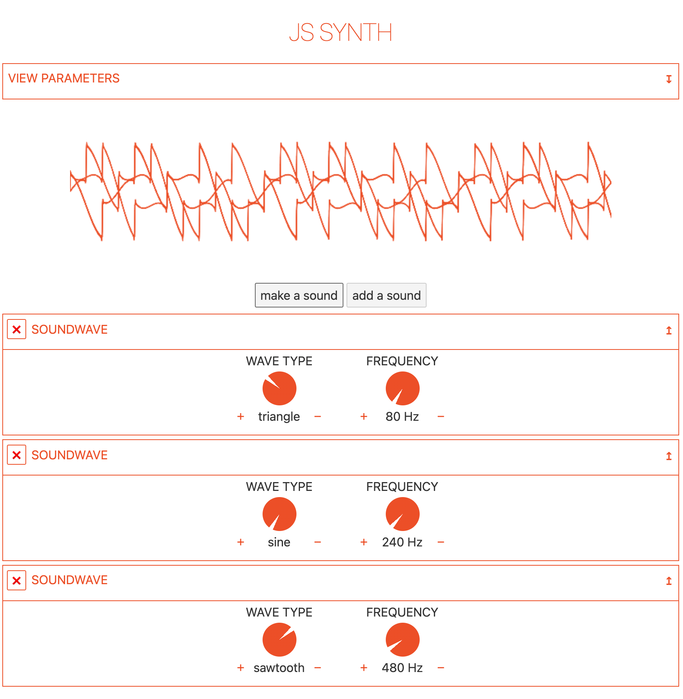

# js-ynth



A playground for soundwave manipulation. Probably sometime something like a Javascript synthesizer.

Based on svelte-app.

## Get started

Install

```bash
cd js-ynth
npm install
```

Start [Rollup](https://rollupjs.org):

```bash
npm run dev
```

Navigate to [localhost:5000](http://localhost:5000). 
## Building and running in production mode

To create an optimised version of the app:

```bash
npm run build
```

You can run the newly built app with `npm run start`. This uses [sirv](https://github.com/lukeed/sirv), which is included in your package.json's `dependencies` so that the app will work when you deploy to platforms like [Heroku](https://heroku.com).

